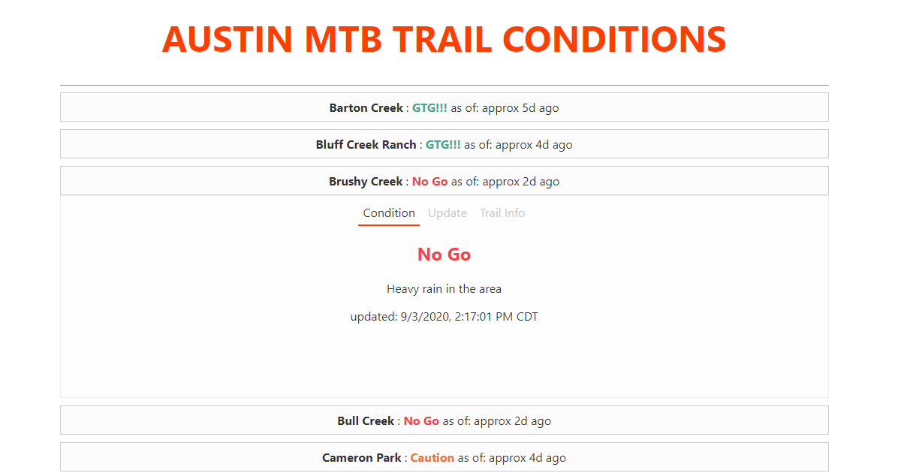

My first Svelte.js project. I am impressed by the speed of development possible with Svelte. It's syntax is simple and terse, but not to the point of esoterica. I like how component composition and events are handled. There's boilerplate like any other "frameworks", but much less than, say, React has. The database is hosted on Firebase.

### App Usage

This is an app to crowd-source trail conditions in the Austin area. Trail conditions are user-reported.Click or tap a trail and you'll be presented with current conditions. If there are no current conditions or they're outdated, hit the "update" tab and update it yourself! It will sync to the live server and will be updated for everyone.

## Technologies Used

[Svelte](https://svelte.dev/)

## Story

In the mountain biking community, at least in Austin, Texas, there's that will put a damper on the local's enjoyment of the trails than a good dose of trail-soaking rain. The volunteer-built trails in the area get damaged from use when wet due to the soil quality in Central Texas. To allieviate these issues, the community posts on an online forum with their reports of trail conditions. This can be handy but accessing the info might require scrolling through posts. I created this app to have a single place to update the conditions.