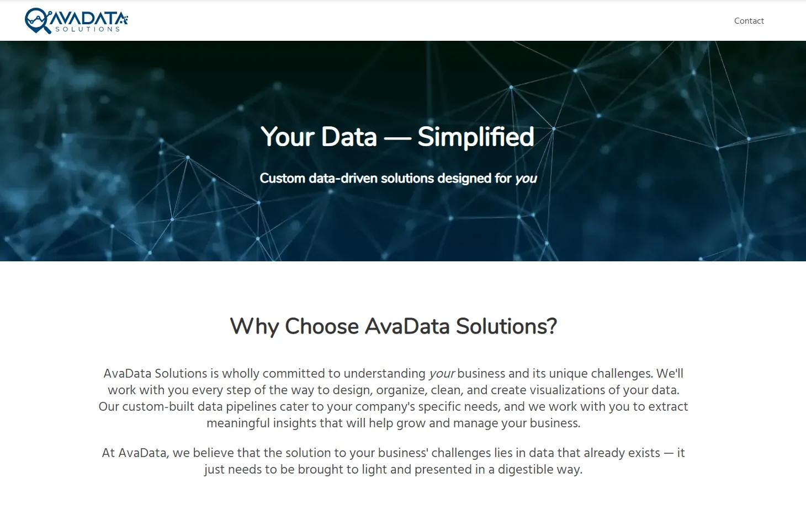

Built in Gatsby and based on the Gatsby Netlify CMS Starter, I created this clean, fast website for AvaData Solutions, Inc., a small business analytics firm based out of Houston. 

A part of their specification was a simple, easy to use Content Management System (CMS) for them to upload their sample projects and example work without any programming knowledge. I chose to build them a simple CMS with the open-source Netlify CMS and it serves their needs.

