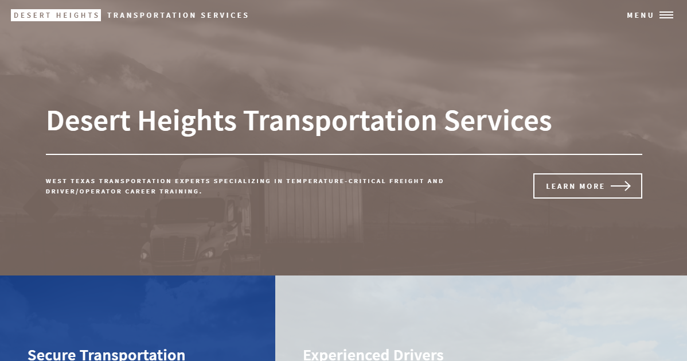

Sample website to present a proof-of-concept to a client who wanted a website with easy-to-add job postings and eye-catching imagery. This website is based on a design by [HTML5UP](https://html5up.net/) called "Forty". My modifications are minimal on the front end, just colors and photos. The back-end would include generative job postings based on text files to reduce time spend manually editing a website.

This is built on Gatsby and hosted on [Surge](https://surge.sh). 

  
