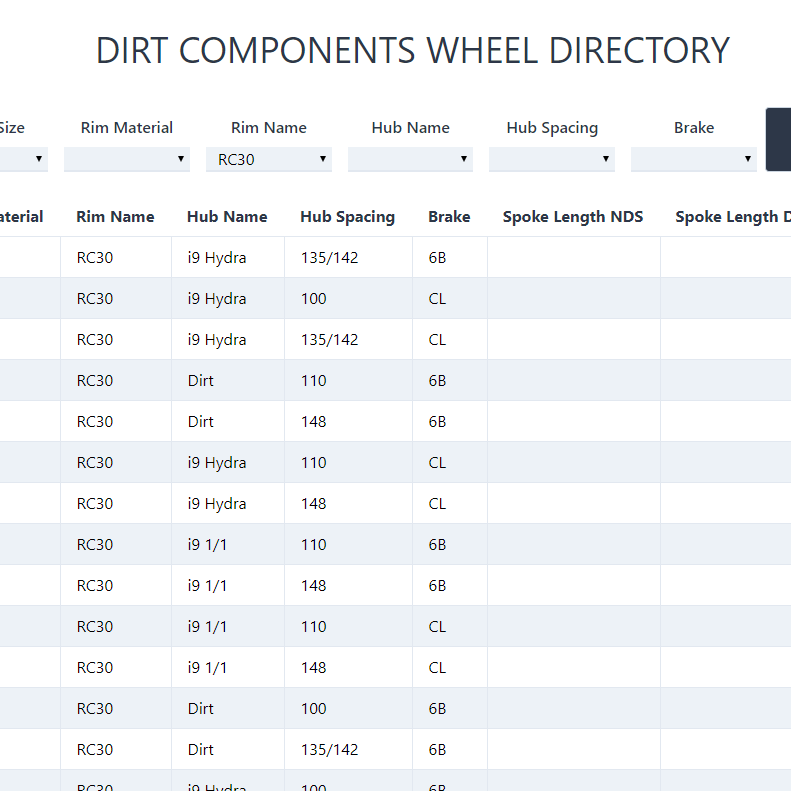

A wheel directory for bicycle wheel company Dirt Bicycle Components. It lists known spoke lengths for various wheel combinations created at the shop. One can organize the wheels in the app and sort it by facets such as model, name, spacing and brake interface.

This project started as a way to practice building with Express, MySQL and React and has now evolved to a more generalized application: [Wheel-Directory](https://github.com/nguyen-michael/wheel-directory)

