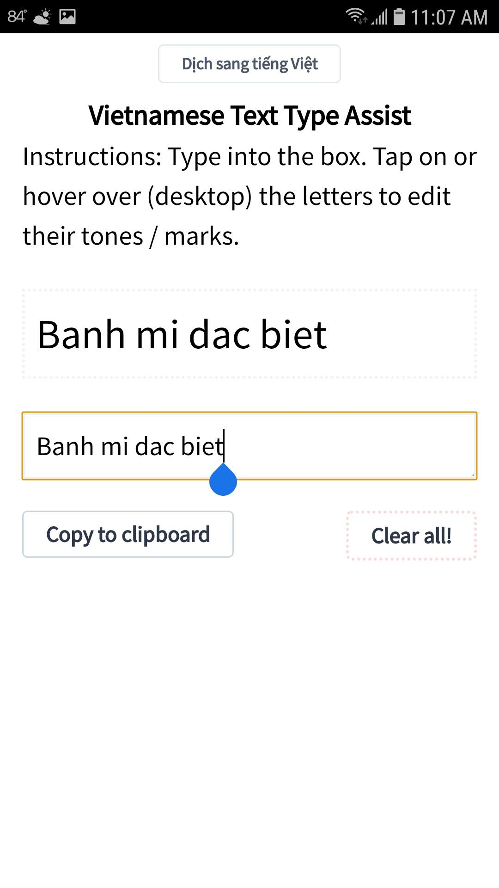
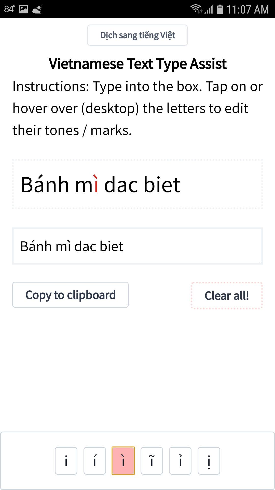
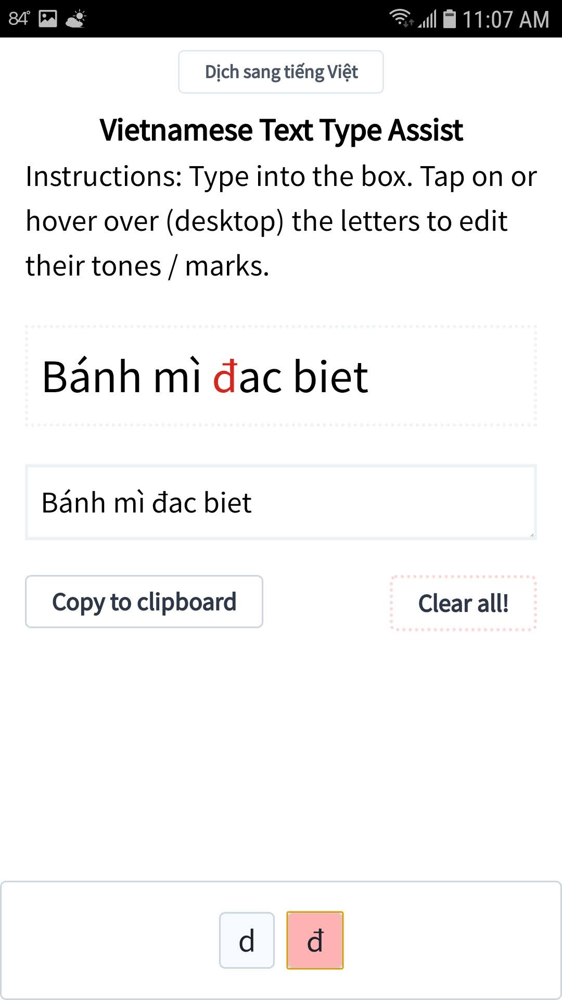
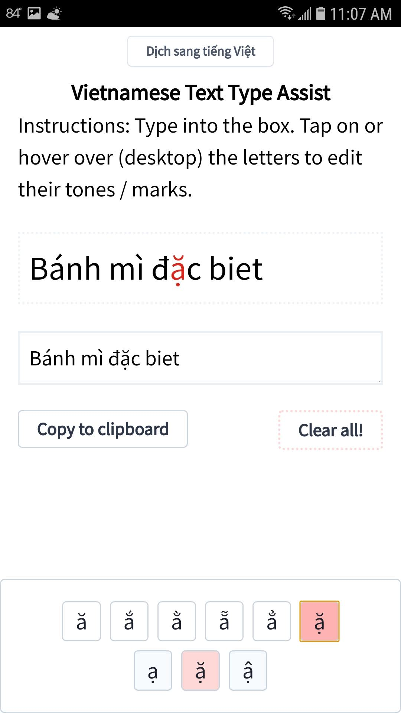
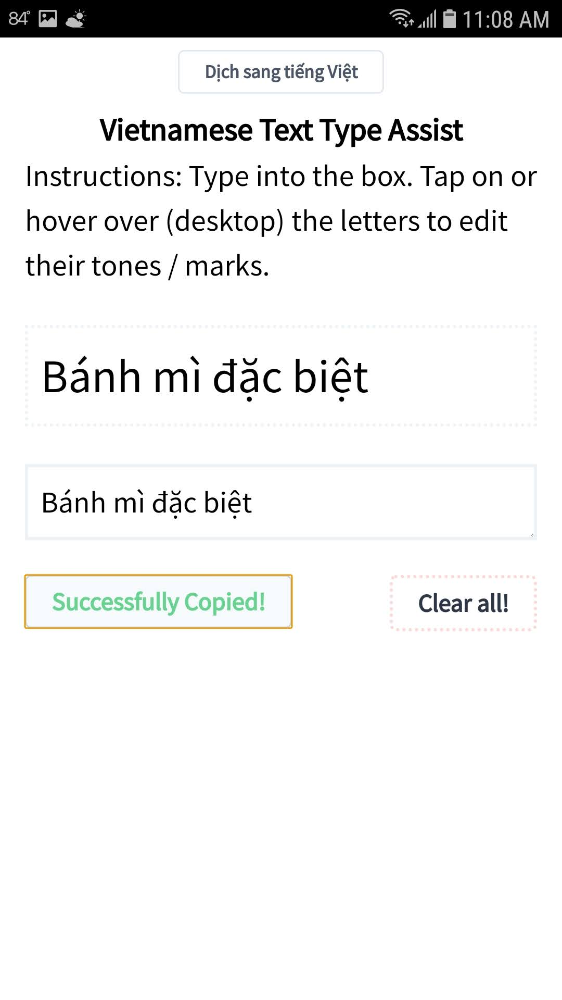
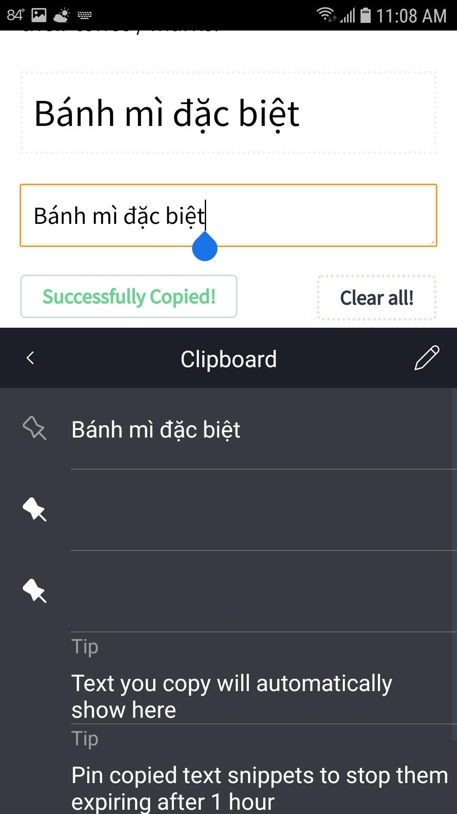

A PWA for typing out Vietnamese characters without using a soft or emulated keyboard. All of the tones and diacritic marks are presented as handy UI buttons. Good for quickly punching in a phrase or a few words without needing to switch to TELEX or another Vietnamese keyboard.

## Usage

Type into the indicated box. Your text will appear in the display box. On Web, hover over the letters which have tone or diacritic marks (a, e, i, o, u, d) and select your choice of tone and diacritic combination. On mobile, press the letter and a selection box will appear. When finished, tap or click "Copy to clipboard" and paste your words/phrases where ever you'd like!

  
  
  
  
  
  

### Progressive Web App

This is purely front-end code and has service workers set up for offline use on mobile devices. Most browsers will allow download/save to device for offline use. Find it in the menu.

## Built With

* [React](https://github.com/facebook/react) - Reactive front-end library
* [Tailwind](https://github.com/tailwindcss/tailwindcss) - CSS Utility library
